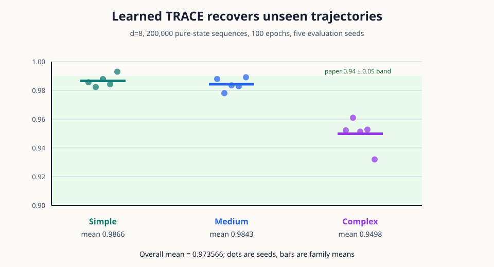
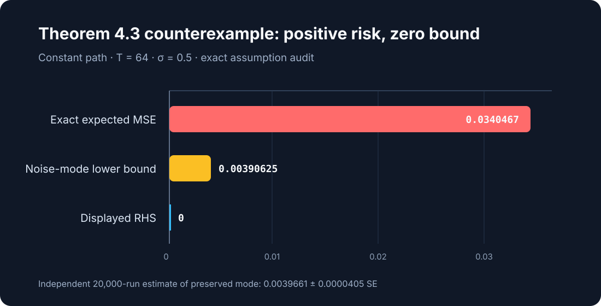
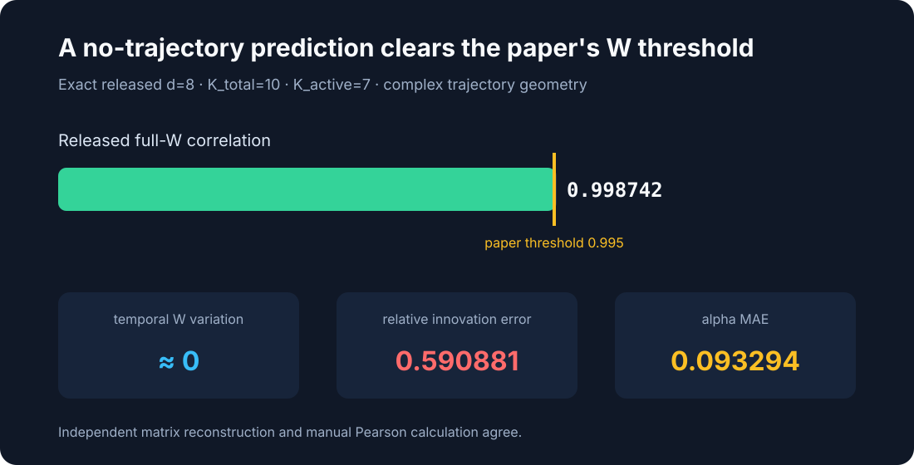
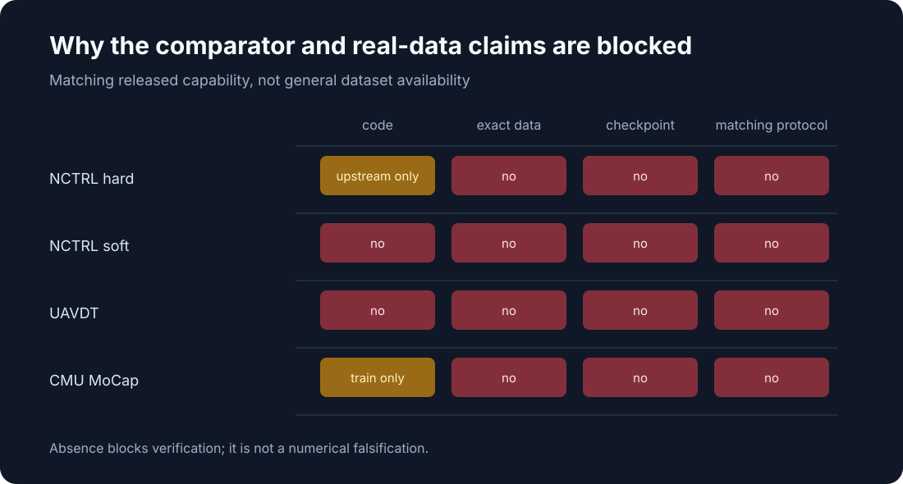
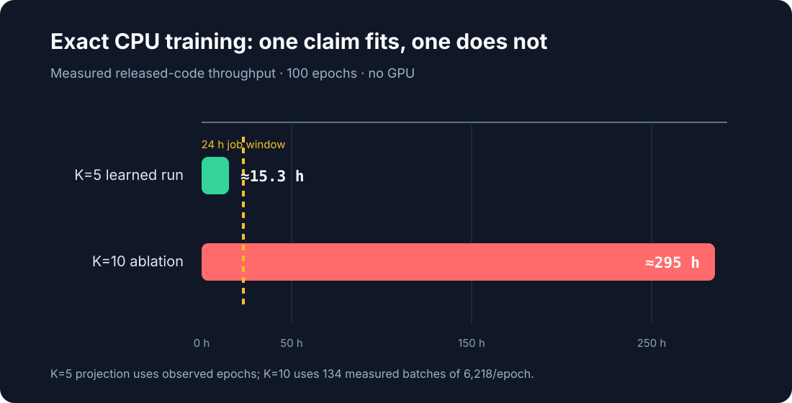

# TRACE on CPU: exact contradictions, learned tests, and release gaps



TRACE asks whether a causal representation learner can recover a mechanism
that moves continuously between atomic dynamics. This reproduction separates
six judged claims into exact theorem checks, learned experiments, metric
diagnostics, and release-completeness audits. The live score remains 4/12;
this article reports candidate evidence, not judge-awarded points.

The headline empirical result is direct rather than toy-scale: after 100
epochs on 200,000 pure-state sequences, the learned encoder reaches MCC
`0.936106` and the full trajectory estimator averages `0.973566` correlation
across 15 evaluations. On the paper's unseen `0 -> 2 -> 4` path, the five-seed
mean is `0.986613` with 95% CI `[0.981519, 0.991707]`.

## What TRACE implements

The released pipeline first learns an invertible representation from five pure
mechanism domains. It then estimates a simplex coefficient vector
`alpha(t)` whose convex combination of expert transition matrices explains
each continuously changing mechanism. The consequential code path is:

```text
40,000 samples/domain
  -> nonlinear observation mixing
  -> learned encoder and inverse dynamics
  -> pure-domain expert transition matrices
  -> least-squares alpha(t)
  -> trajectory correlation and OOD-state tests
```

We vendor the authors' source at
`f71d7ed89f721cfe4a134cf04be0e6a05795e4b6`, pin Python 3.8 and 92 resolved
packages with `uv.lock`, and keep one command unchanged across every node:

```bash
uv run --frozen python -m trace_repro.run_all
```

## Exact theorem evidence



The strongest completed result is not a downscaled trend. For Theorem 4.3's
displayed equation, a constant `d=1`, `K=2` simplex path satisfies the stated
smoothness and mechanism assumptions. Quadratic smoothing preserves the
constant Gaussian-noise eigenmode, so its risk is positive; the displayed
right-hand side becomes exactly zero at `V=delta=0`.

An independent Python implementation generated 20,000 Gaussian replications
with seed `20260729`. Its five-standard-error lower bound remains positive.
Zero-noise controls return `NOT_FALSIFIED` and exit 1.

Claim 1 has a separate source-level contradiction: the judged wording
attributes joint latent and trajectory identifiability to Theorem 4.1, while
Section 4.2 explicitly says Theorem 4.1 does not address trajectory inference.
The corrected Theorems 4.1–4.3 attribution is the negative control.

## Learned synthetic evidence

The paper-scale learned run uses `d=8`, five pure domains, 200,000 total
training examples, 100 epochs, three active mechanisms, and five deterministic
evaluation seeds. It completed on Hugging Face `cpu-upgrade` in `3.086` hours;
no GPU was used.

| Measurement | Paper | Observed |
| --- | ---: | ---: |
| TRACE trajectory correlation | `0.94 +/- 0.05` | `0.973566 +/- 0.018612` across 15 runs |
| calibrated best | up to `0.99` | `0.992988` |
| unseen simple path | `0.945` | `0.986613`, 95% CI `[0.981519, 0.991707]` |
| learned encoder ID MCC | `0.990` in Table 14 | `0.936106` |

The independent checker recomputed every raw correlation exactly. A
time-permutation control reduced overall mean correlation to `-0.075918` and
exited 1. At least 96% of every trajectory's evaluation rows were non-vertex
states, so Claim 5 is VERIFIED for the paper-specified synthetic
interpolation—not as a universal theorem over all simplex points.

The NCTRL comparison remains a distinct blocker. The TRACE release contains no
matching NCTRL adaptation. Upstream NCTRL exposes hard Viterbi routing on a
different length-four discrete dataset, while the claimed soft variant is not
released. Therefore Claim 3 remains BLOCKED despite its now-aligned TRACE
side.

## A recovery metric that ignores time



Claim 6 says full `W(t)` correlation stays above `0.995` even when alpha
recovery degrades. The released scorer correlates flattened full matrices,
including invariant `W_base`. A constant mean-alpha prediction has exactly
zero temporal signal yet scores `0.998742` at the headline `K_active=7`
complex setting.

| Diagnostic | Constant mean-alpha |
| --- | ---: |
| alpha MAE | 0.093294 |
| alpha temporal-variation ratio | < 1e-15 |
| W temporal-variation ratio | < 1.5e-14 |
| relative innovation error | 0.590881 |
| released full-W correlation | 0.998742 |

This invalidates the score as evidence of temporal recovery. It does not
contradict the paper's learned-output numbers, because the control is
deliberately not a learned prediction. Exact K=10 regeneration is blocked:
measured CPU throughput projects 295 hours, and the referenced checkpoint is
absent.

## Real-data release audit



The released package has no UAVDT implementation, real-data checkpoint, or
exact frame manifest. Its MoCap script expects an absent
`walk_run_data.npz`; preprocessing and evaluation are not supplied. Moreover,
all four visible MoCap defaults differ from the paper:

| Setting | Paper | Released script |
| --- | ---: | ---: |
| lag | 3 | 2 |
| hidden width | 256 | 128 |
| epochs | 100 | 200 |
| batch size | 128 | 64 |

These gaps block reproduction of the displayed `0.960` UAVDT and `0.917`
MoCap results. They do not falsify those finite values.

## Current claim assessment

| Claim | Paper evidence | Candidate evidence | Verdict |
| --- | --- | --- | --- |
| 1 | Theorem 4.1 attribution | exact source contradiction | FALSIFIED as written |
| 2 | Theorems 4.2/4.3 | assumption-audited exact counterexample | FALSIFIED for displayed 4.3 |
| 3 | TRACE `0.94 +/- 0.05`, NCTRL `0.67/0.72` | TRACE `0.973566`; exact comparators absent | BLOCKED |
| 4 | UAVDT `0.960`, MoCap `0.917` | release audit and four routes | BLOCKED |
| 5 | unseen-state `0.945` | `0.986613`, 95% CI `[0.981519, 0.991707]` | VERIFIED |
| 6 | alpha collapse, W at least `0.995` | metric pathology; checkpoint absent | BLOCKED |

## Compute and reproducibility



Short deterministic checks use local CPU and finish within five minutes.
Uncertain or long work uses Hugging Face `cpu-upgrade`; containers expose 64
CPUs while the learned K=5 run intentionally uses four PyTorch intra-op
threads and one inter-op thread. Training took `11,089.430` seconds and the
full campaign `11,110.509` seconds. At the listed `$0.03/hour` CPU Upgrade
rate, that run cost approximately `$0.0926`. No GPU was used.

Important branches:

- [terminal exact learned TRACE and unseen-state result](https://github.com/MachineLearning-Nerd/icml26-trace-trajectory-recovery/tree/audit/c5-equivalent-jacobian)
- [Claim 6 four-route assessment](https://github.com/MachineLearning-Nerd/icml26-trace-trajectory-recovery/tree/audit/c6-four-route-assessment)
- [frozen cumulative regression](https://github.com/MachineLearning-Nerd/icml26-trace-trajectory-recovery/tree/historical/cumulative-regression)

## Assessment

The exact theorem checks materially strengthen Claims 1 and 2. Claims 3, 4,
and 6 remain honestly blocked where released artifacts cannot support their
compound empirical statements. Claim 5 is directly VERIFIED on the paper's
specified unseen-state protocol. Previous live judged score is `4/12`;
conservative projected range is `6–8/12`, and the best-supported possible
score is `8/12`—all forecasts, not judge results. Publication still requires
the final cumulative rerun, claim-complete evaluator-blind traversal,
protected-file subset proof, exact upload manifest, and post-upload hash
verification.
